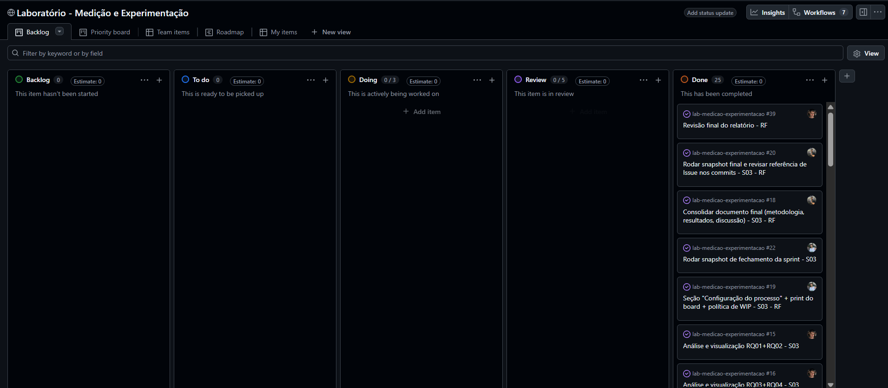
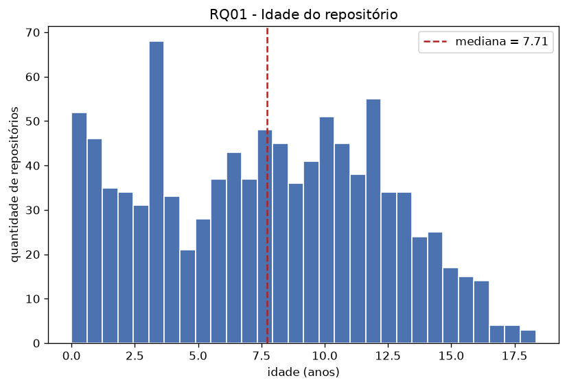
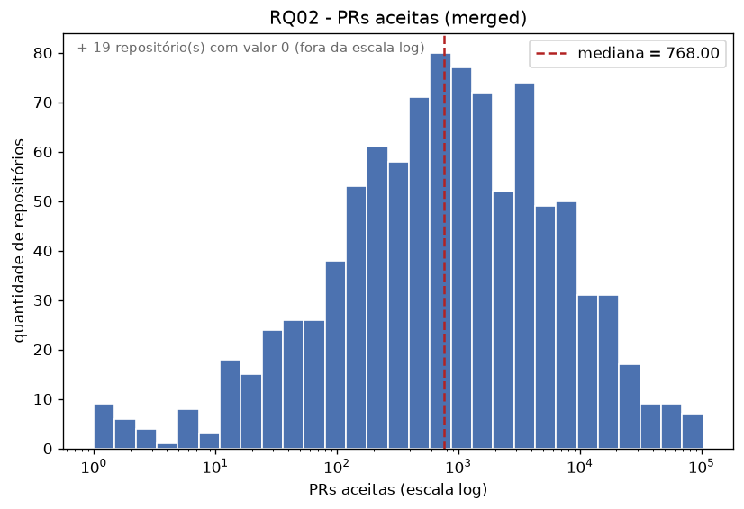
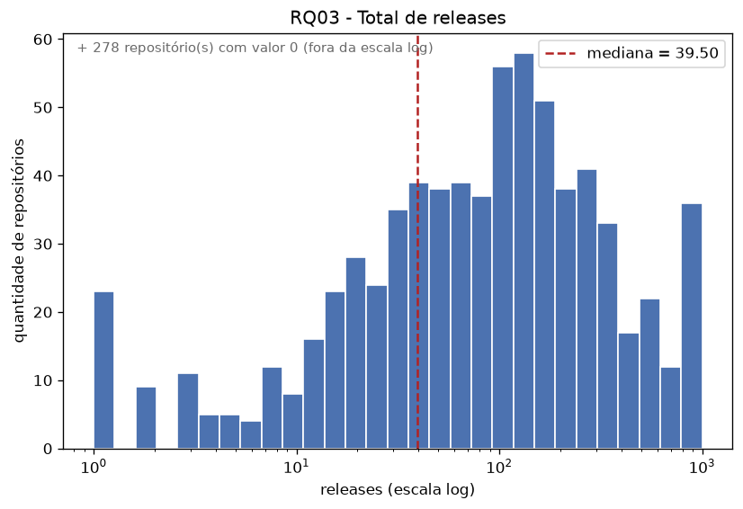
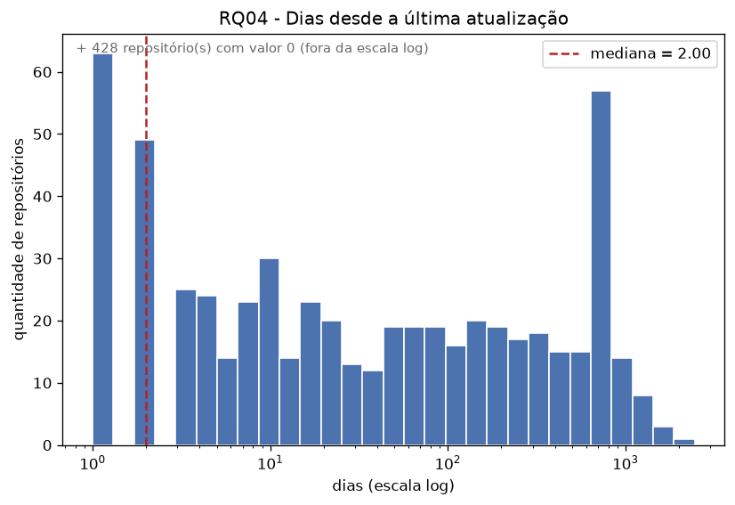
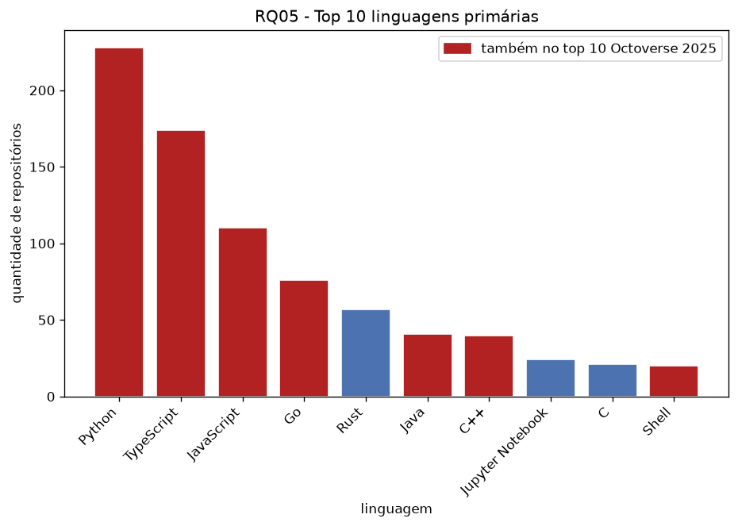
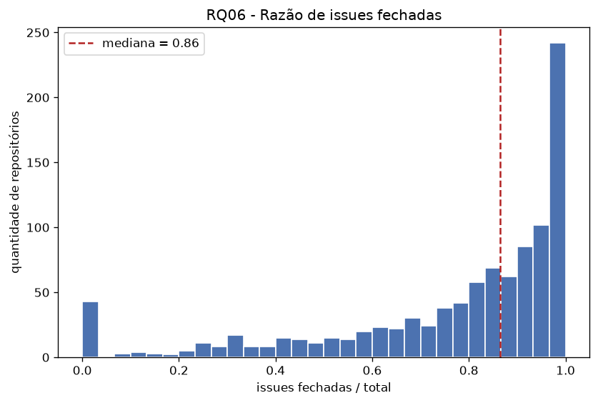
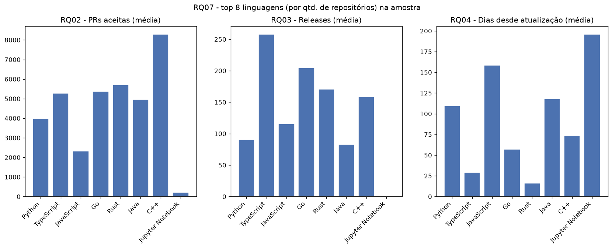

# Relatório de Laboratório

| | |
|---|---|
| **Curso** | Engenharia de Software |
| **Disciplina** | Laboratório de Experimentação de Software |
| **Turno / Período** | Noite / 6º |
| **Professor(a)** | Danilo Maia |
| **Laboratório** | Lab01 - Características de repositórios populares + Setup do Kanban |
| **Grupo (trio)** | Davi Érico dos Santos · Gustavo Azi Prehl Gama · Lucas Alves Resende |
| **Link do repositório / GitHub Projects** | `https://github.com/lucasrsnd/lab-medicao-experimentacao` |
| **Data de entrega** | 27/08/2026 |

## 1. Introdução

Sistemas de código aberto (open-source) tornaram-se a espinha dorsal do desenvolvimento de software moderno. O sucesso e a sustentabilidade desses projetos dependem de uma comunidade ativa, maturidade do código e boas práticas de manutenção.

Neste laboratório, investigamos as principais características dos 1.000 repositórios mais populares do GitHub (medidos pelo número de estrelas), através das seguintes Questões de Pesquisa:

* **RQ01.** Sistemas populares são maduros/antigos? *(métrica: idade do repositório)*
* **RQ02.** Sistemas populares recebem muita contribuição externa? *(métrica: total de PRs aceitas)*
* **RQ03.** Sistemas populares lançam releases com frequência? *(métrica: total de releases)*
* **RQ04.** Sistemas populares são atualizados com frequência? *(métrica: tempo até a última atualização)*
* **RQ05.** Sistemas populares são escritos nas linguagens mais populares? *(métrica: linguagem primária)*
* **RQ06.** Sistemas populares possuem um alto percentual de issues fechadas? *(métrica: razão de issues fechadas)*
* **RQ07.** Sistemas escritos em linguagens mais populares recebem mais contribuição, releases e atualizações? *(métrica: RQ02/RQ03/RQ04 divididas por RQ05)*

### 1.1 Hipóteses Informais

Antes da coleta e análise aprofundada dos dados, estabelecemos as seguintes hipóteses baseadas no senso comum do desenvolvimento de software:

* **RQ01 (Idade):** Acreditamos que sistemas muito populares sejam maduros e antigos, tendo em média mais de 5 anos de criação, tempo necessário para construir uma grande base de usuários e estrelas.
* **RQ02 (Contribuição Externa):** Espera-se que esses projetos recebam um volume massivo de contribuições externas, com a mediana de *Pull Requests* aceitas na casa dos milhares.
* **RQ03 (Releases):** A hipótese é de que projetos populares adotem práticas de integração/entrega contínua, lançando *releases* com alta frequência (várias dezenas por ano).
* **RQ04 (Atualizações):** Espera-se que a atividade seja diária ou semanal. O tempo até a última atualização (último *push*) deve ser, em sua esmagadora maioria, inferior a 7 dias.
* **RQ05 (Linguagem Primária):** Hipotetizamos que as linguagens mais comuns nesses repositórios acompanhem os relatórios de mercado (como o GitHub Octoverse), sendo dominados por JavaScript, Python, TypeScript e Go.
* **RQ06 (Gestão de Issues):** Projetos saudáveis e populares devem possuir um alto engajamento da comunidade e dos mantenedores, refletindo em um percentual de *issues* fechadas superior a 80%.
* **RQ07 (Correlação por Linguagem):** Acreditamos que repositórios escritos nas linguagens mais populares (Top 3) receberão proporcionalmente mais PRs, mais *releases* e atualizações mais frequentes, devido ao maior tamanho de suas comunidades de desenvolvedores.

### 1.2 Contribuições do grupo além do enunciado

Além das 7 RQs pedidas, o grupo optou por três frentes de contribuição própria, detalhadas na Seção 3.6: **(a)** um dashboard interativo em Streamlit, complementar ao relatório estático; **(b)** uma paginação adaptativa e resumível (checkpoint/retry) para lidar com falhas intermitentes da API na coleta dos 1000 repositórios; **(c)** uma validação estatística individual (distribuição + outliers via IQR) por RQ na base completa, antes de qualquer hipótese informal ser registrada.

## 2. Contexto

Este é o primeiro laboratório da disciplina, responsável por iniciar tanto a rotina de mineração de dados via API quanto o quadro Kanban (GitHub Projects) que acompanhará o grupo até o final do semestre, a estrutura de colunas e a política de WIP definidas aqui (Seção 3.3) são a base usada nos laboratórios seguintes.

O objeto de estudo são os 1.000 repositórios mais populares do GitHub, medidos por número de estrelas, um critério de popularidade amplamente usado tanto em pesquisa quanto no próprio discurso de mercado do GitHub. A ideia geral por trás do laboratório é que popularidade (estrelas) se correlacione com maturidade e boas práticas de manutenção. Como por exemplo a idade, contribuição externa, cadência de releases, atualização, escolha de linguagem e gestão de issues, mas essa correlação não é garantida, e é isso que as 7 RQs investigam empiricamente (Seção 4.3).

Como referência conceitual para "linguagens mais populares" (RQ05/RQ07), adotamos o **GitHub Octoverse**, edição 2025, mantido como fonte única do início ao fim do laboratório (ver Seção 6, Referências).

## 3. Metodologia

A coleta foi feita inteiramente via **GraphQL API do GitHub**, com script próprio do grupo (Python + `requests` + `python-dotenv`), sem bibliotecas de terceiros que abstraem a API. **Critério de amostragem:** os repositórios foram buscados com `search(query: "stars:>1 sort:stars-desc", type: REPOSITORY, ...)`, ordenados do maior para o menor número de estrelas, não existe uma lista fixa de repositórios, o "top N" é definido dinamicamente no momento da consulta.

### 3.1 Principais Desafios

* **Erro 502 intermitente da Search API (S01).** Pedir os 100 repositórios do Lab01S01 numa única chamada GraphQL (com todos os campos aninhados de todo mundo juntos) retornava erro 502. Descartamos rate limit (esperamos 70s e 4min, o erro persistiu) e complexidade da query (a mesma query, isolada, funcionava em lotes menores) como causa, concluímos ser uma instabilidade genuína e intermitente do lado do GitHub. Resolvido paginando por cursor (`after`/`pageInfo`) em lotes pequenos, com backoff exponencial entre tentativas.
* **998 em vez de 1000 repositórios coletados (S02).** Na coleta de 1000 repositórios (execução de vários minutos), o índice "vivo" da Search API do GitHub muda durante a consulta, fazendo `hasNextPage` virar `false` antes do esperado. Verificamos que não há duplicatas e que o cursor avançou corretamente em toda a paginação, concluímos ser um comportamento documentado da API operando em escala, não uma falha do script ou perda de dados.
* **Ausência de histórico de mudança de coluna no GitHub Projects (v2)**, que não expõe via API quando um cartão mudou de status, resolvido com snapshots manuais recorrentes (um script GraphQL próprio, ao final de cada sprint) em vez de depender de um histórico que a ferramenta não fornece.
* **Repositórios com métricas nativas do GitHub sub-representadas.** Alguns projetos populares não usam certos recursos nativos do GitHub para seu fluxo real de trabalho (ex.: `torvalds/linux`, que recebe contribuições por lista de e-mail em vez de Pull Requests, e por isso aparece com 0 PRs aceitas). A métrica mede um canal específico de contribuição, não a colaboração real do projeto — discutido com mais detalhe na Seção 4.3.

### 3.2 Tomadas de Decisão

* **Limite de WIP = 3** para a coluna Doing (detalhado na Seção 3.3): como a equipe tem 3 integrantes, esse limite garante no máximo uma tarefa simultânea por pessoa, evitando *context switching* e incentivando revisão mútua antes de puxar um novo cartão.
* **Paginação adaptativa e resumível**, em vez de uma reexecução do zero a cada falha: tamanho de página reduzido pela metade após um erro e aumentado gradualmente após sucessos consecutivos, com checkpoint em disco para retomar de onde parou. Escolhida depois de esgotar outras explicações para o 502 (não era rate limit nem complexidade), ver Seção 3.6a.
* **Aceitar os 998 repositórios coletados na S02**, em vez de forçar uma nova coleta para completar 1000: como o desvio é um comportamento documentado da API (índice vivo), e não um bug do script, decidimos manter e documentar o número real em vez de mascará-lo artificialmente.
* **Repositórios sem linguagem primária classificável entram como `"N/A"`** na contagem da RQ05, em vez de serem descartados da amostra, mantém a base íntegra (998 em toda RQ) e explicita quantos casos existem, em vez de reduzir a amostra silenciosamente.
* **GitHub Octoverse (2025) mantido como única fonte de "linguagens populares"** do início ao fim do laboratório (RQ05 e RQ07), conforme exigido pelo enunciado, em vez de misturar fontes (TIOBE, GitHut) entre RQs.
* **Streamlit escolhido para o dashboard** por permitir reaproveitar a mesma camada de análise (`src/analysis/`) usada nas figuras estáticas do relatório, evitando duas implementações de cálculo divergentes entre as duas apresentações.

### 3.3 Etapas

**Processo em 3 sprints + Relatório Final:**

1. **S01 - validação individual em amostra pequena (10 repositórios):** cada integrante testou a extração da sua parte, conferindo manualmente se os valores batiam com a página do GitHub, antes de integrar tudo num script único de consulta GraphQL.
2. **S02 - paginação para 1000 repositórios:** o mesmo mecanismo de paginação por cursor foi estendido para a base completa (fechou em 998 repositórios, ver Seção 3.1), salva em `data/raw/repositorios_s02.csv`. Cada integrante validou individualmente a consistência da sua parte (distribuição, outliers pela regra do IQR, valores ausentes) e registrou uma hipótese informal antes de calcular o resultado real.
3. **S03 - análise e visualização:** cálculo das estatísticas finais e geração dos gráficos (`reports/figures/`) a partir da base de 998 repositórios, usando `pandas` para as estatísticas e `matplotlib`/`streamlit` para as visualizações.
4. **Relatório Final:** consolidação deste documento.

| Sprint | Entregas | Responsável(is) | Issues (nº) |
|---|---|---|---|
| S01 | Extração/validação individual de cada RQ numa amostra de 10 repositórios; integração no script único de consulta GraphQL; requisição automática; GitHub Projects criado (colunas + WIP) | Gustavo (RQ01, RQ02); Lucas (RQ03, RQ04, integração do script único); Davi (RQ05, RQ06, viabilidade da RQ07) | #1 #2 #8 · #3 #4 #7 · #5 #6 #24 |
| S02 | Paginação adaptativa para 1000 repositórios (998 coletados); dados exportados em `.csv`; validação individual (distribuição/outliers/IQR) + hipótese informal por RQ; 1ª versão do relatório; script de snapshot do board | Gustavo (paginação, export CSV, validação RQ01/RQ02); Lucas (validação RQ03/RQ04, script de snapshot); Davi (validação RQ05/RQ06/RQ07, 1ª versão do relatório) | #9 #10 #21 · #11 #14 · #12 #13 |
| S03 | Análise estatística e visualização das 7 RQs (dashboard interativo + figuras estáticas); consolidação do documento final; seção "Configuração do processo" + print do board; snapshot de fechamento | Gustavo (análise/visualização RQ01-RQ07); Lucas (consolidação do relatório, snapshot final); Davi (config. do processo, snapshot de fechamento) | #15 #16 #17 · #18 #20 · #19 #22 |
| Relatório Final | Revisão final: gráficos embutidos com legenda, seção de inovações, tabela de sprints, tabela de métricas expandida, referências, conclusão | Gustavo | #39 |

#### Configuração do processo

O gerenciamento e o rastreamento das tarefas deste laboratório foram realizados utilizando o **GitHub Projects**, com abordagem visual baseada no sistema Kanban, refletindo o progresso real e contínuo do grupo (link no cabeçalho deste documento).

**Colunas do board (Status):**
* **Backlog:** Tarefas planejadas e identificadas, aguardando priorização para as próximas sprints.
* **To Do:** Issues selecionadas para a sprint atual, prontas para serem assumidas.
* **Doing:** Tarefas em desenvolvimento ativo pelo seu responsável.
* **Review:** Atividades implementadas aguardando revisão de código (Pull Requests) ou validação do grupo.
* **Done:** Tarefas aprovadas, mergeadas na branch principal e totalmente concluídas.

**Política de WIP (Work in Progress):** limite de **3** para a coluna Doing. Como a equipe é formada por 3 integrantes, esse limite garante que cada membro trabalhe em no máximo uma tarefa de forma simultânea. Essa restrição evita a perda de foco (*context switching*), previne o gargalo de tarefas incompletas e incentiva a colaboração mútua e o auxílio nas revisões antes de puxar um novo cartão.

### 3.4 Ferramentas

* **Python 3.13** como linguagem única do projeto.
* **GraphQL API do GitHub**, consumida via `requests` + script próprio (sem biblioteca de terceiros que abstraia a API, conforme exigido pelo enunciado).
* **`python-dotenv`** para carregar o token de API a partir de `.env`.
* **pandas** para manipulação de dados e estatísticas descritivas (`describe()`, IQR, `groupby`).
* **matplotlib** para as figuras estáticas do relatório (`reports/figures/`).
* **Streamlit** para o dashboard interativo (`app_streamlit.py`, ver Seção 3.6a).
* **GitHub Projects (v2)** como ferramenta de processo, com snapshots exportados via GraphQL (`scripts/snapshot_project.py`).

### 3.5 Tabela de Métricas

| RQ | Métrica | Definição Operacional | Unidade | Ferramenta / Fonte |
|---|---|---|---|---|
| RQ01 | Idade do repositório | Data da coleta − `createdAt` | Anos | Script GraphQL (API do GitHub) |
| RQ02 | PRs aceitas | `pullRequests(states: MERGED).totalCount` | Contagem (nº de PRs) | Script GraphQL (API do GitHub) |
| RQ03 | Total de releases | `releases.totalCount` | Contagem (nº de releases) | Script GraphQL (API do GitHub) |
| RQ04 | Tempo até última atualização | Data da coleta − `pushedAt` | Dias | Script GraphQL (API do GitHub) |
| RQ05 | Linguagem primária | `primaryLanguage.name` (repositórios sem linguagem classificável marcados `"N/A"`) | Categórica (nome da linguagem) | Script GraphQL + GitHub Octoverse 2025 (referência de "linguagens populares") |
| RQ06 | Razão de issues fechadas | `issues(states: CLOSED).totalCount / issues.totalCount` (0,0 quando o total é 0) | Proporção (0–1) | Script GraphQL (API do GitHub) |
| RQ07 | Comparação por linguagem | Média de RQ02, RQ03 e RQ04, agrupada por `primaryLanguage.name` | Médias (mesmas unidades de RQ02/RQ03/RQ04) | `pandas.groupby` sobre os dados de RQ02/RQ03/RQ04/RQ05 |

### 3.6 Inovações Propostas pelo Grupo (30% da nota)

**(a) Dashboard interativo em Streamlit.** Além do relatório estático (obrigatório pelo enunciado), o grupo construiu um dashboard (`app_streamlit.py`) com uma aba por RQ, reaproveitando a mesma camada de análise (`src/analysis/stats.py`, `figures.py`, `rq_config.py`) usada nas figuras estáticas — garantindo que as duas apresentações nunca divirjam entre si (mesma ordem de RQs, mesmo texto de legenda). Permite exploração ad-hoc dos dados além dos gráficos fixos da Seção 4.2.

**(b) Paginação adaptativa e resumível para a coleta de 1000 repositórios.** Não exigida pelo enunciado (que pede apenas "paginação"), mas necessária na prática para lidar com o erro 502 intermitente encontrado na S01, numa escala 10x maior na S02. Implementa: ajuste dinâmico de tamanho de página (reduz pela metade em falha, aumenta gradualmente após sucessos consecutivos), checkpoint em disco para retomar a coleta de onde parou em caso de interrupção, e verificação do rate limit da API (`rateLimit.remaining`/`resetAt`) antes de cada página. Essa decisão é o que viabilizou a base de 998 repositórios usada em toda a análise (Seções 4 e 5).

**(c) Validação estatística individual por integrante, na base completa (S02).** Cada RQ foi validada com estatística descritiva (`describe()`: mediana, média, min/max) e detecção de outliers pela regra do IQR, antes de qualquer hipótese informal ser registrada, vai além do "valores medianos" pedido no enunciado. Essa validação alimenta diretamente a Discussão (Seção 4.3): os percentuais de outliers por RQ (ex.: 12,3% em RQ02, 19,0% em RQ04) explicam por que a média isoladamente é enganosa nesses casos, e reforçam o uso da mediana como medida central.

## 4. Resultados

### 4.1 Coleta de Dados

A coleta teve como alvo 1.000 repositórios (top estrelas do GitHub) e fechou em **998 repositórios** efetivamente coletados e analisados, motivo detalhado na Seção 3.1 (comportamento da Search API em coletas longas, não falha de dados). Não houve necessidade de descartar repositórios por dados incompletos: todos os 998 têm valor válido em todas as 6 métricas de campo (RQ01-RQ06); a única lacuna sistemática é a linguagem primária ausente em alguns repositórios, tratada como categoria `"N/A"` (Seção 3.2) em vez de exclusão.

Outliers foram identificados pela regra do IQR (intervalo interquartil) para cada métrica numérica, mas **mantidos na amostra**, são pontos de dado reais (ex.: `firstcontributions/first-contributions` com 103.014 PRs aceitas), não erros de coleta, e a discussão de cada um está na Seção 4.3.

### 4.2 Visualização Gráfica

*(figuras completas em `reports/figures/`; mesmas legendas reproduzidas abaixo em `reports/figures/legendas.md`)*

**RQ01 - Sistemas populares são maduros/antigos?**

Distribuição da idade dos repositórios (anos desde a criação), com a mediana destacada. Mediana: **7,72 anos** (média 7,65, min 0,00, max 18,34). Sem outliers pela regra do IQR - distribuição concentrada e sem cauda pesada. Mais antigos: `rails/rails` (18,34 anos), `git/git` (18,06). Mais novos: repositórios ligados à onda de IA que já acumularam estrelas suficientes em poucos meses.

**RQ02 - Sistemas populares recebem muita contribuição externa?**

Distribuição do total de pull requests aceitas (merged) por repositório, em escala log. Mediana: **768** (média 4.211,5, 5,5x maior que a mediana). 123 outliers pela regra do IQR (12,3%), indicando distribuição fortemente assimétrica à direita. Maior: `firstcontributions/first-contributions` (103.014, projeto cujo propósito é ensinar a abrir a primeira PR). Menor: `torvalds/linux` (0, o kernel Linux não usa PR nativo do GitHub, contribui por lista de e-mail).

**RQ03 - Sistemas populares lançam releases com frequência?**

Distribuição do total de releases publicadas por repositório, em escala log. Mediana: **39,5** (média 127,4). 92 outliers pela regra do IQR (9,2%). 27,9% dos repositórios têm 0 releases. Maiores: `langchain-ai/langchain`, `vercel/next.js`, `ggml-org/llama.cpp`, `electron/electron`, `storybookjs/storybook`, todos batendo exatamente em 1000 - provável teto de contagem do campo `releases.totalCount` na paginação usada, e não o total real.

**RQ04 - Sistemas populares são atualizados com frequência?**

Distribuição de dias entre o último push (`pushedAt`) e a data da coleta, em escala log. Mediana: **2 dias** (média 112,6 dias, puxada por outliers). 190 outliers pela regra do IQR (19,0%). 61,3% dos repositórios foram atualizados na última semana. Maior tempo sem atualizar: `exacity/deeplearningbook-chinese` (2.445 dias, quase 7 anos).

**RQ05 - Sistemas populares são escritos nas linguagens mais populares?**

Top 10 linguagens primárias entre os repositórios da amostra, com destaque para as que também aparecem no top 10 do GitHub Octoverse. Top 3: **Python** (228), **TypeScript** (174), **JavaScript** (110). 43 linguagens distintas identificadas, nenhum valor ausente na base de 998 (repositórios sem linguagem classificável ficaram marcados como "N/A" e entraram na contagem). Top 3 do laboratório coincide com o top 3 do GitHub Octoverse 2025.

**RQ06 - Sistemas populares possuem um alto percentual de issues fechadas?**

Distribuição da razão entre issues fechadas e o total de issues por repositório. Mediana: **0,86** (86%). 4,3% dos repositórios com 0 issues cadastradas ou funcionalidade desativada (razão forçada a 0,0 nesses casos). 60 outliers pela regra do IQR.

**RQ07 - Sistemas escritos em linguagens mais populares recebem mais contribuição, releases e atualizações?**

Comparação das médias de PRs aceitas (RQ02), releases (RQ03) e dias desde a última atualização (RQ04) entre as linguagens mais frequentes na amostra (RQ05). TypeScript apresentou a maior mediana de PRs aceitas (1.985) entre as linguagens mais frequentes, mas **Rust** (2.491) e **Go** (1.690), bem menos frequentes no top 1.000, superaram Python (559,5) e JavaScript (630). Ou seja, volume de repositórios numa linguagem não é proporcional ao volume de contribuição externa por repositório.

### 4.3 Discussão: Hipótese vs. Resultado

| RQ | Hipótese | Resultado | Confirmou? |
|---|---|---|---|
| RQ01 | Maduros, média > 5 anos | Mediana 7,72 anos, sem outliers relevantes | **Sim** |
| RQ02 | Contribuição na casa dos milhares | Mediana de 768 (não milhares) | **Parcial** |
| RQ03 | Releases frequentes (dezenas por ano) | Mediana 39,5, mas 27,9% com 0 releases | **Parcial** |
| RQ04 | Atualização quase sempre < 7 dias | Mediana 2 dias, 61,3% na última semana | **Sim** |
| RQ05 | Dominado por JS/Python/TS/Go | Top 3 = Python, TS, JS (bate com Octoverse) | **Sim** |
| RQ06 | Issues fechadas > 80% | Mediana 86% | **Sim** |
| RQ07 | Top 3 linguagens concentram mais contribuição/releases/atualização | Rust e Go (menos frequentes) superaram Python/JS em PRs | **Não** |

**RQ01:** a hipótese de maturidade se confirma como norma (mediana bem acima de 5 anos, distribuição concentrada), mas o mínimo em 0 anos mostra que popularidade extrema também pode ser alcançada quase instantaneamente. A maturidade é regra, não unanimidade.

**RQ02:** a hipótese superestimou a escala (esperávamos "milhares", saiu "centenas"), mas a direção geral está certa: populares recebem mais contribuição do que projetos comuns. O achado mais importante aqui é metodológico: `torvalds/linux` aparece com 0 PRs aceitas não por falta de contribuição, mas porque o kernel usa lista de e-mail em vez do mecanismo nativo de PR do GitHub. A métrica mede um canal específico, não "contribuição externa" em geral, e projetos com workflow fora do GitHub aparecem artificialmente como pouco colaborativos, uma ameaça de validade de construto que se repete na RQ06.

**RQ03:** esse foi o achado que mais contrariou a expectativa inicial da nossa dupla (RQ03/RQ04). A amostra pequena do S01 (10 repositórios) sugeria fortemente que a maioria não lançava releases, mas isso era coincidência de amostra: caiu em várias listas/coleções do tipo `awesome-*`, que não são representativas do conjunto todo. Na base de 998, a maioria lança releases sim, e alguns projetos de software ativo lançam com bastante frequência (a ponto de bater no teto de contagem do campo).

**RQ04:** confirmada com folga. Mediana de 2 dias mostra que a maioria dos repositórios populares tem manutenção realmente ativa. A cauda longa também apareceu como esperado (19% de outliers), puxada por projetos de referência/didáticos que são conteúdo mais estático do que software em manutenção contínua.

**RQ05:** confirmada, e de forma direta. O top 3 do laboratório bate exatamente com o top 3 do Octoverse 2025, reforçando que o ecossistema open-source mais popular do GitHub acompanha as tendências gerais de mercado.

**RQ06:** confirmada com margem (86% vs. 80% hipotetizado), reforçando que repositórios populares mantêm boa saúde de gestão de issues. Vale notar que alguns projetos massivos (`torvalds/linux` entre eles) aparecem com razão 0,0 porque desativaram issues no GitHub, mesma limitação de métrica observada na RQ02.

**RQ07:** foi a hipótese refutada com mais clareza. Não é o volume de repositórios numa linguagem que determina o volume de contribuição por repositório. Linguagens de nicho mais especializado (Rust, Go) tiveram medianas de PRs mais altas que linguagens dominantes em quantidade (Python, JavaScript). Isso sugere que projetos em linguagens menos populares, mas que ainda assim atingem o top 1.000 por estrelas, tendem a ser projetos de infraestrutura/sistemas com comunidades muito engajadas proporcionalmente ao seu tamanho.

**Ameaças à validade:**
* **Amostra não é fixa e não é reprodutível a um segundo:** o "top 1000 por estrelas" é dinâmico, uma nova coleta em outro momento pode retornar um conjunto ligeiramente diferente, sujeito ao mesmo comportamento de índice vivo discutido na Seção 3.1 (998 vs. 1000).
* **Teto de contagem em `releases.totalCount`:** vários dos maiores valores de RQ03 batem exatamente em 1000, sugerindo um limite da paginação usada e não o total real - isso pode estar subestimando outliers superiores em RQ03 e RQ07.
* **Validade de construto em métricas nativas do GitHub:** PRs e issues medem um canal específico de colaboração, não a colaboração real do projeto - projetos com fluxo de trabalho fora do GitHub (RQ02, RQ06) aparecem distorcidos.
* **Coleta feita num único ponto no tempo** (S02), sem replicação longitudinal - não capturamos variação sazonal de atividade.

As três inovações da Seção 3.6 aprofundaram essa discussão em vez de apenas confirmar os 70% do enunciado: a validação por IQR (c) foi o que permitiu identificar os percentuais de outliers citados acima e justificar o uso da mediana; a paginação adaptativa (b) é o motivo pelo qual a base de 998 existe e é confiável (sem duplicatas, cursor íntegro); e o dashboard (a) permite ao leitor conferir qualquer um desses números interativamente, além dos gráficos fixos desta seção.

## 5. Conclusão

Das 7 RQs investigadas, 4 confirmaram a hipótese informal (RQ01, RQ04, RQ05, RQ06), 2 confirmaram parcialmente na direção mas não na escala esperada (RQ02, RQ03), e 1 foi refutada com clareza (RQ07). O padrão geral que emerge é que repositórios populares no GitHub são, sim, majoritariamente maduros, ativamente mantidos e bem geridos em termos de issues - mas a intensidade de contribuição externa (RQ02) e a frequência de releases (RQ03) têm cauda muito mais longa e heterogênea do que o senso comum sugeria, e a linguagem de programação (RQ07) não é um bom preditor de quanto um projeto específico vai receber de contribuição.

**Principais limitações do estudo:** amostra de 998 em vez de 1000 repositórios (Seção 3.1); possível teto de contagem em `releases.totalCount` distorcendo a cauda superior de RQ03/RQ07; métricas nativas do GitHub (PRs, issues) subestimando projetos com fluxo de trabalho externo à plataforma (`torvalds/linux` sendo o caso mais visível); e uma coleta feita num único ponto no tempo, sem repetição.

Com mais tempo, o grupo investigaria: (i) uma segunda coleta em outro momento do semestre, pra medir o quanto o "top 1000" e suas métricas variam ao longo do tempo; (ii) uma forma de contornar o teto aparente de `releases.totalCount`, paginando o campo `releases` diretamente em vez de usar `totalCount`; (iii) expandir a RQ07 para uma correlação estatística formal (ex.: Spearman) em vez de comparação de médias/medianas por grupo. Das três inovações da Seção 3.6, a que mais valeria a pena expandir é a paginação adaptativa (b) - o mecanismo de checkpoint/retry construído aqui é reaproveitável para qualquer coleta futura da disciplina que também dependa da API do GitHub em escala.

## 6. Referências

* GITHUB. **Octoverse 2025**: the state of open source. Disponível em: `https://octoverse.github.com/`. Acesso em: 2026.
* ZUSE, Horst. **A framework of software measurement**. Walter de Gruyter, 2013.
