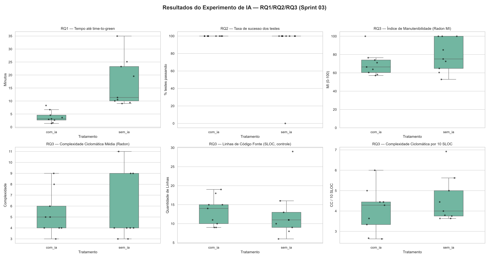
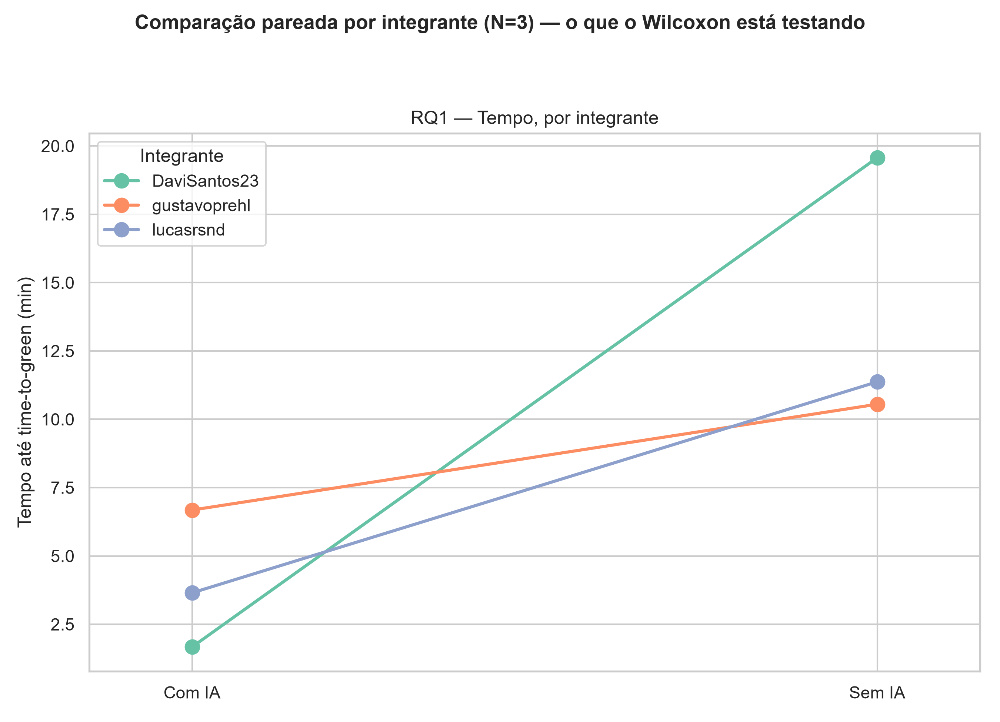
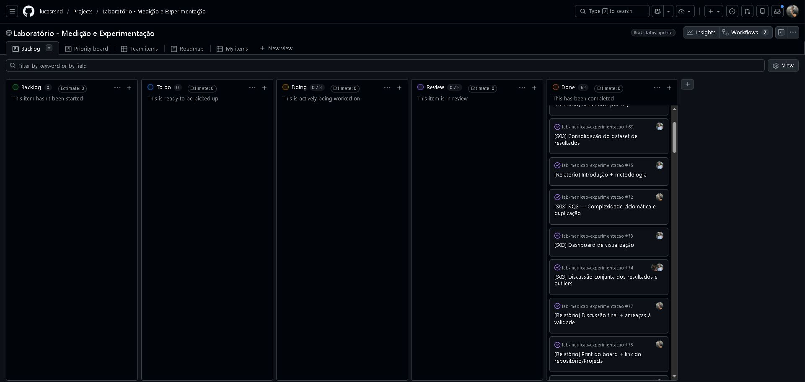

# Relatório de Experimento: Impacto de Assistentes de IA no Desenvolvimento de Software

**Disciplina:** Medição e Experimentação em Engenharia de Software (PUC Minas)  
**Equipa:** Davi Érico, Gustavo Prehl, Lucas Resende  

---

## 1. Introdução

A adoção de assistentes de Inteligência Artificial (IA) generativa transformou o panorama do desenvolvimento de software, prometendo ganhos significativos de produtividade. No entanto, é fundamental quantificar empiricamente se a velocidade de entrega compromete a qualidade estrutural e a manutenibilidade do código produzido. 

Este experimento visa avaliar o impacto do uso de IA na resolução de problemas algorítmicos (*Katas*), medindo tanto o tempo de desenvolvimento até à aprovação nos testes automáticos (*time-to-green*) quanto as métricas estáticas do código fonte gerado.

### 1.1 Hipóteses
Para guiar a análise estatística, definimos as seguintes hipóteses:
* **H1 (Tempo de Desenvolvimento):** O tratamento `com_ia` reduz significativamente o *time-to-green* em comparação com o tratamento `sem_ia`.
* **H2 (Qualidade Estrutural - Complexidade):** Não existe diferença estatisticamente significativa na Complexidade Ciclomática (McCabe) entre o código produzido com e sem o auxílio da IA.
* **H3 (Qualidade Estrutural - Duplicação):** O código gerado no tratamento `com_ia` apresenta uma taxa de duplicação igual ou inferior ao código produzido no tratamento `sem_ia`.

---

## 2. Metodologia

Para garantir a validade interna e a reprodutibilidade dos resultados, o laboratório foi estruturado sob um rigoroso protocolo de medição e isolamento de variáveis.

### 2.1 Desenho Experimental (Crossover Within-Subject)
O experimento utilizou um design *crossover within-subject*, onde os três participantes (Davi, Gustavo, Lucas) foram expostos a ambos os tratamentos (`com_ia` e `sem_ia`). Foram definidos 6 desafios de programação (Katas K1 a K6). A distribuição dos katas garantiu que cada participante resolvesse metade dos problemas com IA e a outra metade de forma estritamente manual, alternando a ordem para mitigar o viés de aprendizagem.

### 2.2 Os Katas (Desafios)
Os katas consistiram em problemas clássicos de lógica e estruturas de dados, com testes unitários (Pytest) previamente redigidos e imutáveis durante a execução (Sprint 02). Exemplos de desafios incluíram: extração de dados de *logs* (K1), cálculo de troco com controlo de stock (K3), validação robusta de palavras-passe (K4) e achatamento de dicionários aninhados por recursividade (K5).

### 2.3 Assistente de IA e Versão
No tratamento `com_ia`, os participantes utilizaram o assistente **Claude** integrado ao ambiente de desenvolvimento (modelo específico não fixado previamente — ver `docs/ambiente-execucao.md` e a ameaça à validade de construto na Seção 5.2). O *prompting* foi livre, mas focado na geração da lógica necessária para satisfazer os critérios de aceitação. No tratamento `sem_ia`, qualquer ferramenta de preenchimento inteligente de código foi estritamente desativada.

### 2.4 Ambiente de Execução e Coleta de Dados
A automação da coleta de métricas foi o pilar da reprodutibilidade:
* **Tempo Real (Time-to-Green):** Desenvolveu-se um *script* customizado em Python (`trial_timer.py`) rodando em *background* via *polling* a cada 10 segundos. O relógio parava automaticamente assim que todos os testes passassem, ou era aplicado um limite de censura de 35 minutos (*time-box*).
* **Métricas Estáticas:** A análise de código foi extraída através das bibliotecas **Radon** (Complexidade Ciclomática, *Maintainability Index* e SLOC) e **jscpd** (taxa de duplicação de *tokens*). Os ficheiros de teste (`test_*.py`) foram isolados e ignorados pelo analisador para não corromper os resultados do código-fonte submetido.

---

## 3. Resultados por RQ

> Números completos e os dois cenários de sensibilidade (com/sem o outlier de
> instrumentação, ver Seção 5.1) em `reports/analysis/` e nos textos-fonte
> `docs/resultados-rq1-rq2.md` e `docs/resultados-rq3.md`. Figura consolidada:
> `reports/figures/dashboard_tratamentos.png` (Figura 1, abaixo).

*Figura 1 — Tempo (RQ1), taxa de sucesso dos testes (RQ2) e quatro métricas
estruturais da RQ3 (complexidade ciclomática, SLOC, complexidade normalizada
por LOC e índice de manutenibilidade) por tratamento. Cada ponto é um trial;
a caixa mostra mediana/IQR, não a média, como recomendado no enunciado dado
o N pequeno. Duplicação de código fica fora do gráfico por ser 0% em todos
os 18 trials, sem variância para mostrar.*

### RQ1 — O uso de assistente de IA reduz o tempo necessário para resolver uma tarefa de programação?

| Tratamento | N | Mediana (min) | IQR | Mín | Máx |
|---|---|---|---|---|---|
| Com IA | 9 | 3.17 | 1.92 | 1.40 | 8.31 |
| Sem IA | 9 | 11.37 | 13.24 | 9.06 | 35.00 |

Wilcoxon pareado por integrante (N=3 pares, mediana dos 3 trials de cada
tratamento por pessoa): **estatística = 0.0, p = 0.25** — o menor p-valor
bilateral possível com N=3 no teste exato, portanto não significativo a 5%,
mas os **três integrantes foram individualmente mais rápidos Com IA**
(Davi: 1.67 vs 19.57 min; Gustavo: 6.68 vs 10.55 min; Lucas: 3.65 vs 11.37
min) — direção consistente apesar do N pequeno não permitir confirmação
estatística. Houve 1 trial censurado (35 min, Sem IA), tratado como
outlier de instrumentação e não descartado (Seção 5.1).

*Figura 2 — Comparação pareada por integrante: é exatamente essa figura que
o Wilcoxon acima está testando (mediana de 3 pontos por pessoa e
tratamento). As três linhas sobem de Com IA para Sem IA — direção
consistente mesmo sem significância estatística.*

### RQ2 — O uso de assistente de IA reduz a quantidade de defeitos (testes que falham) no código produzido?

| Tratamento | N | Mediana (% testes passando) | IQR |
|---|---|---|---|
| Com IA | 9 | 100.00 | 0.00 |
| Sem IA | 9 | 100.00 | 0.00 |

Wilcoxon pareado por integrante (N=3): **p = 1.00** — nenhuma diferença
detectável. Praticamente todos os trials terminaram com 100% dos testes de
aceitação passando, nos dois tratamentos (efeito teto — Seção 5.2). Os dados
não sugerem qualquer efeito do assistente de IA sobre defeitos nesta amostra.

### RQ3 — O uso de assistente de IA altera a complexidade ciclomática ou a duplicação do código produzido?

| Métrica | Mediana Com IA (IQR) | Mediana Sem IA (IQR) | p (por integrante, N=3) | p (por kata, N=6) |
|---|---|---|---|---|
| CC média por função | 5.00 (2.00) | 4.00 (5.00) | 1.00 | 1.00 |
| Duplicação (%) | 0.00 (0.00) | 0.00 (0.00) | n/a¹ | n/a¹ |
| SLOC (controle) | 14.00 (5.00) | 11.00 (4.00) | 0.50 | 0.56 |
| CC por 10 SLOC | 4.29 (1.11) | 4.00 (1.25) | 1.00 | 0.84 |
| MI | 66.45 (13.66) | 75.16 (35.14) | 0.75 | 0.44 |

¹ Duplicação zero em todos os 18 trials — diferenças pareadas todas zero, teste não informativo.

Nenhum Wilcoxon se aproxima de significância. As medianas de CC e MI variam
mais por *kata* do que por tratamento (ex.: K1 sem IA usa `split`/`if`
encadeados, CC 11; as duas soluções com IA do K1 usam regex, CC 4–5 — troca
de estratégia, não de qualidade, e a CC de McCabe não enxerga a
complexidade escondida no regex). O código Com IA tende a ser um pouco mais
longo (SLOC), coerente com a ressalva do enunciado sobre verbosidade de
código gerado por IA; normalizando por LOC (CC/10 SLOC), os tratamentos
ficam praticamente iguais. **Não há evidência de que a IA altere a
complexidade ou a duplicação nesta amostra** — não rejeita H0, mas o poder
estatístico (N=3/N=6) também não permite afirmar equivalência. Detalhamento
completo, incluindo o cenário sem o outlier de instrumentação, em
`docs/resultados-rq3.md`.

---

## 4. Discussão

**Produtividade sem custo mensurável de qualidade.** O resultado mais claro do
experimento é o de tempo (RQ1). A mediana do *time-to-green* caiu de 11.37 min
(Sem IA) para 3.17 min (Com IA), e os três integrantes foram mais rápidos com
IA. Esse ganho não veio acompanhado de piora detectável nas outras duas
dimensões. A taxa de sucesso foi de 100% nos dois tratamentos (RQ2), e
complexidade ciclomática, duplicação e complexidade normalizada por LOC ficaram
praticamente iguais (RQ3). Nenhum teste de Wilcoxon atingiu significância.
Portanto, a leitura correta é que o efeito sobre o tempo é **consistente em
direção, mas não confirmado estatisticamente**, e que não há evidência de
efeito sobre defeitos ou estrutura. Nas duas últimas dimensões, H0 não foi
rejeitada. As hipóteses H2 e H3 da Seção 1.1 (sem diferença de complexidade;
duplicação com IA igual ou inferior) são compatíveis com os dados, mas o N não
permite afirmar equivalência.

**Por que o ganho de tempo foi tão grande.** Os katas são problemas curtos (6 a
29 SLOC, uma função cada), bem especificados e com testes de aceitação prontos.
Esse é o cenário mais favorável possível para um assistente de IA: o enunciado
cabe inteiro em um prompt e a resposta é verificável na hora. O
`log_trials.csv` sugere que pouca interação bastou. Nos trials Com IA
registrados (Gustavo), houve 0 ou 1 prompt de chat, e o resto foi autocomplete
aceito via Tab. Não se deve extrapolar esse ganho para tarefas maiores, com
contexto espalhado em vários arquivos ou requisitos ambíguos.

**A IA mudou a estratégia, não a qualidade.** O caso do K1 (parser de log)
ilustra bem a RQ3. A solução manual usou `split`/`if` encadeados (CC 11, 29
SLOC), e as duas soluções com IA usaram uma expressão regular (CC 4 a 5). Pela
métrica, a solução com IA é "menos complexa". Na prática, a complexidade foi
transferida para dentro do regex, que a CC de McCabe não enxerga. Isso reforça
a recomendação do enunciado de ler as métricas estáticas junto com LOC e com
cautela. Em código deste tamanho, elas refletem mais o *estilo* de solução do
que a qualidade estrutural.

**Duplicação não é observável nesta escala.** Com uma função por solução,
nenhum trial teve clone interno. O único clone que o jscpd encontrou apareceu
*entre* trials: o mesmo laço do K4 no trial do Lucas (Com IA) e no do Davi (Sem
IA). É convergência para a solução idiomática, e não indício de que a IA gere
código repetido. Para responder de fato à pergunta de duplicação da RQ3 seriam
necessárias tarefas com mais de uma responsabilidade (várias funções ou
classes).

**Escolha do cenário de análise.** Um trial (Davi, K2 Sem IA) foi censurado por
um bug de infraestrutura do pytest, e não pela dificuldade da tarefa. Todas as
análises foram rodadas com e sem ele, e as conclusões das três RQs são as
mesmas nos dois cenários. Por isso a decisão de incluí-lo ou não altera os
números, mas não as respostas.

**Trabalhos futuros.** Para um experimento conclusivo, seria preciso: (i) mais
participantes, porque com N=3 pares o Wilcoxon exato nunca fica abaixo de
p = 0.25 (ver Seção 5.4); (ii) ordem de tratamentos realmente alternada para
todos (ex.: quadrado latino); (iii) a mesma suíte de testes para todos os
trials de um kata; (iv) modelo de IA fixado e registrado em todos os trials;
(v) tarefas maiores, em que complexidade e duplicação tenham espaço para
variar.

---

## 5. Ameaças à Validade

Organizadas pela classificação de Wohlin et al. (interna, de construto,
externa e de conclusão).

### 5.1 Validade interna

- **Ordem dos tratamentos confundida com o tratamento.** Pelos timestamps de
  `trials_tempo.csv`, Gustavo e Lucas fizeram **os três trials Sem IA antes
  dos três Com IA** (Gustavo: K4→K5→K6 sem IA, depois K1→K2→K3 com IA; Lucas:
  K1→K2→K3 sem IA, depois K4→K5→K6 com IA). Só o Davi intercalou
  (K2 sem → K1, K3, K5 com → K4, K6 sem). O contrabalanceamento de
  `katas/README.md` alternava *katas* entre integrantes, mas não a *ordem* dos
  tratamentos dentro da sessão. Aquecimento no ambiente e familiaridade com o
  formato dos katas favorecem os trials Com IA na RQ1, e o efeito de tempo
  pode estar superestimado.
- **Conhecimento prévio dos katas.** O Davi elaborou os katas e o scaffold dos
  testes de aceitação (Milestone `Lab02S01`) e depois os resolveu como
  participante. Os tempos dele Com IA (1.4 a 2.97 min) são os menores do
  experimento. Parte disso pode ser conhecimento do problema, e não efeito da
  IA.
- **Falha de instrumentação.** O trial Davi/K2 Sem IA foi censurado por
  colisão de import do pytest, e não pela tarefa (corrigido no commit
  `9a79389`). Ele foi tratado com análise de sensibilidade (dois cenários),
  sem descarte silencioso.
- **Contaminação do tratamento Sem IA.** A desativação do assistente seguiu a
  checklist de `docs/ambiente-execucao.md`, mas dependeu da disciplina de cada
  integrante, sem monitoramento externo.
- **Resolução do cronômetro.** O `trial_timer.py` faz *polling* a cada 10 s,
  então o *time-to-green* tem erro de até ~10 s. Isso é irrelevante para
  diferenças de minutos, mas pesa nos trials Com IA mais curtos (~1.5 min).

### 5.2 Validade de construto

- **Critérios de aceitação diferentes para o mesmo kata.** Os trials do
  Gustavo usaram suítes de teste diferentes das do Lucas e do Davi, com mais
  testes (ex.: K2 com 8 testes contra 3; K1 e K3 com 5 contra 3) e até nomes de
  função diferentes (`parse_log` contra `extrair_dados_log` no K1). Lucas e
  Davi usaram arquivos de teste idênticos entre si. Assim, *time-to-green* e
  taxa de sucesso não foram medidos contra exatamente o mesmo critério em
  todos os trials de um kata.
- **Efeito teto na RQ2.** Quase todos os trials terminaram com 100% dos testes
  passando. Com suítes de 2 a 8 testes, a taxa de sucesso tem pouca
  resolução para distinguir qualidade funcional.
- **Limitações das métricas estáticas nesta escala.** A CC de McCabe não
  captura a complexidade de expressões regulares (caso do K1). O MI do Radon
  satura em 100 em arquivos pequenos (4 dos 18 trials). A duplicação ficou em
  0% em todos os trials porque soluções de uma função não atingem o limiar do
  jscpd (3 linhas / 20 tokens), um efeito piso que torna a métrica pouco
  informativa aqui.
- **Modelo de IA não fixado.** O assistente foi fixado (Claude), mas o modelo
  não foi. O `log_trials.csv` registra o modelo (Sonnet 5) apenas nos trials do
  Gustavo, e não há registro do modelo nem do número de prompts nos trials Com
  IA do Lucas e do Davi. Uma variação de modelo entre trials não pode ser
  descartada.

### 5.3 Validade externa

- **Amostra.** São 3 participantes, todos estudantes de graduação do mesmo
  grupo e também pesquisadores do experimento. Não representam
  desenvolvedores profissionais nem pessoas sem interesse no resultado.
- **Tarefas.** Os katas são pequenos, isolados e bem especificados, bem
  diferentes de manutenção em sistemas reais (código legado, múltiplos
  arquivos, requisitos ambíguos). Linguagem única (Python) e um único
  assistente (Claude).
- **Memorização.** Os katas são autorais, o que reduz o risco de a IA
  reproduzir uma solução vista no treinamento. Mesmo assim, alguns seguem
  padrões muito comuns (validação de senha no K4, parsing de log no K1), para
  os quais o modelo certamente viu soluções parecidas.

### 5.4 Validade de conclusão

- **Poder estatístico muito baixo.** No pareamento por integrante (N=3), o
  menor p-valor bilateral possível no Wilcoxon exato é 0.25. **O desenho não
  tinha como rejeitar H0 a 5%**, mesmo com um efeito real e grande, como
  sugere a RQ1. O pareamento complementar por kata na RQ3 (N=6) tem mínimo de
  p ≈ 0.031, ainda muito pouco poder.
- **Agregação por mediana antes do teste.** Parear medianas de 3 trials por
  integrante descarta a variabilidade dentro de cada pessoa. Isso foi
  necessário porque o desenho não pareia trial a trial, mas reduz ainda mais a
  informação disponível.
- **Múltiplas comparações.** A RQ3 testa 5 métricas × 2 pareamentos × 2
  cenários sem correção (ex.: Bonferroni). Como nenhum resultado foi
  significativo, isso não gera falso positivo aqui, mas uma replicação com N
  maior deveria aplicar a correção.

---

## 6. Repositório e GitHub Projects

- **Repositório:** https://github.com/lucasrsnd/lab-medicao-experimentacao
  (código em `Lab-02/`)
- **GitHub Projects (board Kanban):** https://github.com/users/lucasrsnd/projects/2
  (projeto "Laboratório - Medição e Experimentação", com Milestones `Lab02S01`,
  `Lab02S02`, `Lab02S03` e `Lab02-RelatorioFinal`)

Todos os 18 trials estão registrados como Issues individuais (#51 a #68, uma
por kata/tratamento, com o integrante como Assignee), e os commits de cada
trial referenciam o número da Issue correspondente.

